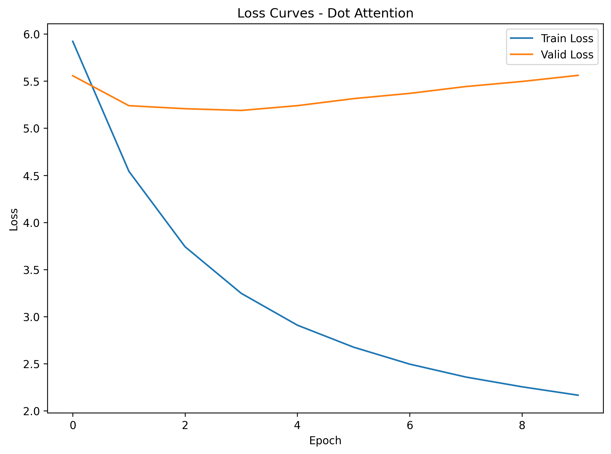
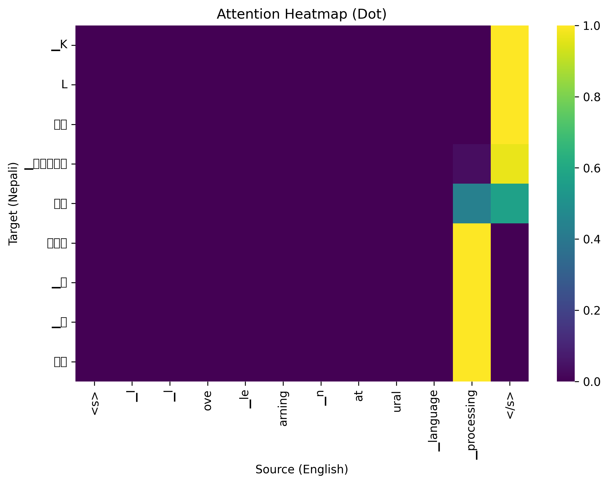

# Nepali–English Neural Machine Translation using Attention

This project implements a **Neural Machine Translation (NMT)** system for  
**English → Nepali** translation using a **Sequence-to-Sequence (Seq2Seq) model with attention**.

The system is trained on a parallel corpus and deployed as a **Flask web application**
that allows interactive translation through a web browser.

---

## 1. Problem Statement

Machine translation between English and Nepali is challenging due to:

- Morphological richness of Nepali
- Flexible word order
- Limited high-quality parallel data

This project aims to:

- Build an attention-based neural machine translation model
- Compare **Dot-product** and **Additive** attention mechanisms
- Visualize attention alignments
- Deploy the trained model as a web application

---

## 2. Dataset

### Dataset Used

- **OPUS-100 Nepali–English Parallel Corpus**
- Source: OPUS Project (https://opus.nlpl.eu/)
- Subset: `opus100`
- Language pair: English–Nepali (`en–ne`)

The dataset contains aligned sentence pairs suitable for supervised neural machine translation.

---

## 3. Data Preprocessing

### Text Cleaning
- Trim whitespace
- Remove placeholder tokens such as `_inv` and `inv`
- Discard empty or very short sentences

### Tokenization
- **SentencePiece (BPE)** is used for subword tokenization
- Separate tokenizers trained for English and Nepali

**Advantages:**
- Handles unknown words
- Reduces vocabulary size
- Suitable for morphologically rich languages such as Nepali

### Special Tokens

| Token | Purpose |
|------|--------|
| `<bos>` | Beginning of sentence |
| `<eos>` | End of sentence |
| `<pad>` | Padding |

Dynamic padding is applied during batching.

---

## 4. Model Architecture

### Encoder
- Embedding layer
- GRU (Gated Recurrent Unit)
- Packed sequences for variable-length inputs

### Decoder
- Embedding layer
- GRU
- Attention mechanism
- Linear projection to target vocabulary

---

## 5. Attention Mechanisms

### Dot-Product (Luong) Attention
Computes alignment scores using the dot product between the decoder hidden state
and encoder outputs:

\[
e_i = s^\top h_i
\]

### Additive (Bahdanau) Attention
Computes alignment scores using a feed-forward neural network that jointly learns
the interaction between encoder and decoder states.

Both mechanisms are implemented and trained separately for comparison.

---

## 6. Training Configuration

### Hyperparameters

| Parameter | Value |
|---------|------|
| Embedding dimension | 256 |
| Hidden dimension | 512 |
| RNN layers | 1 |
| Dropout | 0.2 |
| Optimizer | Adam |
| Learning rate | 0.001 |
| Loss function | CrossEntropyLoss (padding ignored) |
| Epochs | 10 |

### Training Details
- Teacher forcing during training
- Gradient clipping for stability
- Validation performed after each epoch

---

## 7. Evaluation

### Loss Analysis
- Training loss decreases consistently
- Validation loss plateaus early, indicating mild overfitting

### BLEU Score Evaluation

| Attention Type | Validation BLEU |
|---------------|-----------------|
| Dot Attention | **10.68** |
| Additive Attention | **8.64** |

The reported BLEU scores are relatively low in absolute terms:

Dot Attention Validation BLEU: 10.68

Additive Attention Validation BLEU: 8.64

This behavior is expected and can be attributed to several factors:

Small evaluation subset
BLEU was computed on a limited validation/test sample, which reduces statistical reliability.

Morphological richness of Nepali
Nepali exhibits inflectional variations that penalize exact n-gram matching despite correct semantics.

Subword tokenization mismatch
SentencePiece subword boundaries may differ between reference and generated translations, lowering BLEU even when translations are semantically correct.

Short sentence bias
Many test examples are short UI-style phrases, where BLEU is known to be unstable.

Therefore, BLEU scores should be interpreted as relative indicators for comparing attention mechanisms rather than absolute measures of translation quality. Qualitative inspection and attention visualizations confirm that the model learns meaningful alignments and produces reasonable translations.

---

## 8. Results and Visualizations

### Training and Validation Performance

| Attention Type | Training Loss | Training PPL | Validation Loss | Validation PPL |
|---------------|---------------|--------------|------------------|----------------|
| Dot Attention | 2.166 | 8.72 | 5.561 | 259.7 |
| Additive Attention | 2.009 | 7.46 | 5.617 | 275.6 |

### Loss Curves

**Dot Attention**


**Additive Attention**


### Attention Heatmap

**Dot Attention Alignment**


The heatmap shows learned alignments between English source tokens and Nepali target tokens.

---

## 9. Web Application

A **Flask-based web application** demonstrates real-time translation.

### Features
- English text input
- Nepali translation output
- Input text persists after translation
- Uses trained model and SentencePiece tokenizers

### Example Translation

**Input:**  
What is your name?

**Output:**  
तपाईँको नाम


The translation captures the core semantic meaning, though some function words are omitted.

---

## 10. How to Run the Project

### Create Virtual Environment
```bash
python -m venv .venv


```
```
assignment3/
├── app/
│   ├── app.py
│   ├── model.py
│   ├── templates/
│   │   └── index.html
│   ├── requirements.txt
├── models/
│   ├── mt_dot.pt
│   └── mt_additive.pt
├── spm/
│   ├── sp_en.model
│   ├── sp_ne.model
├── results/
│   ├── loss_dot.png
│   ├── loss_additive.png
│   ├── attn_dot.png
├── README.md
```

### 11. Conclusion
This project demonstrates a complete neural machine translation pipeline:
from preprocessing and attention-based modeling to visualization and deployment.

Dot-product attention provides a strong and lightweight baseline for
English–Nepali translation, while additive attention offers comparable performance
with higher computational cost.
